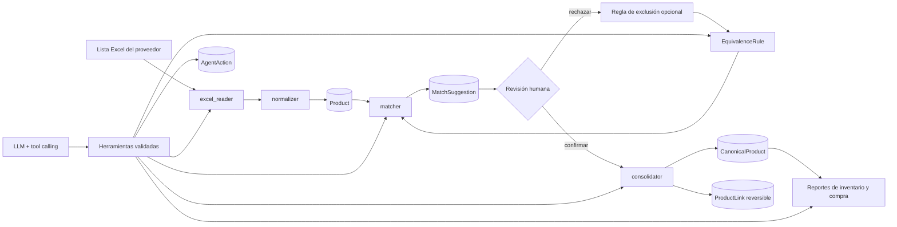

# Arquitectura de StockMind

## Flujo completo

## Capas

### Persistencia

SQLAlchemy y SQLite almacenan el producto original (`Product`), el catálogo real (`CanonicalProduct`), vínculos (`ProductLink`), sugerencias (`MatchSuggestion`), reglas (`EquivalenceRule`), importaciones (`ImportRecord`) y bitácora del agente (`AgentAction`). Cada importación conserva la ruta del archivo y su resumen.

### Servicios

- `excel_reader.py`: detecta encabezado, mapea alias y devuelve filas crudas.
- `normalizer.py`: limpia nombres, extrae atributos y convierte precios colombianos.
- `matcher.py`: combina nombre, atributos, precio y categoría; devuelve score y razones.
- `rules_engine.py`: evalúa reglas activas, prioriza exclusiones y reporta conflictos.
- `consolidator.py`: crea el canónico y los vínculos auditables; permite revertirlos.
- `importer.py`: coordina lectura, validación, idempotencia y persistencia.

### API

`Backend/Api/rest.py` expone la superficie canónica `/api/v1`. Los listados son paginados y usan filtros por query string. Los errores se transforman en JSON uniforme. Las importaciones y el chat tienen un rate limit sencillo por IP y ruta.

## Por qué es un entorno agéntico

No hay un router que decida según palabras como `grip` o `freno`. El agente recibe el mensaje y el historial, entrega al LLM el catálogo de herramientas y ejecuta los `tool_calls` que el modelo solicita, hasta ocho iteraciones. Cada resultado vuelve al historial para que el modelo decida el siguiente paso.

Las herramientas disponibles son:

- importar Excel;
- buscar productos;
- consultar catálogo canónico;
- sugerir equivalencias;
- interpretar reglas naturales;
- listar reglas;
- consolidar productos;
- generar inventario;
- comparar precios;
- sugerir compras.

El agente puede cambiar el estado mediante importaciones, reglas confirmadas y consolidaciones aprobadas. Las acciones destructivas no se ejecutan desde el primer `tool_call`: devuelven `confirmation_required`, se registran en `AgentAction` y esperan `POST /api/v1/agent/confirm`. Si el usuario rechaza, se registra la decisión y no se modifica el catálogo.

## Decisiones y trazabilidad

El matcher penaliza contradicciones de atributos con fuerza: un grip rojo y uno azul no se convierten en equivalentes solo porque compartan tokens. Las razones se guardan en `MatchSuggestion` para que la revisión no dependa de una cifra opaca.

Una consolidación siempre deja `ProductLink`. El vínculo conserva producto original, canónico, confianza, origen y confirmador. Revertir un vínculo elimina la relación sin borrar la fila original del proveedor.

## Fronteras operativas

- El LLM se configura por `LLM_API_KEY`, `LLM_API_URL` y `LLM_MODEL`; sin clave, el agente informa que no está configurado.
- No se inventan datos: los estados vacíos del frontend reflejan tablas vacías.
- El frontend consume exclusivamente `/api/v1` y no contiene métricas de demostración.
